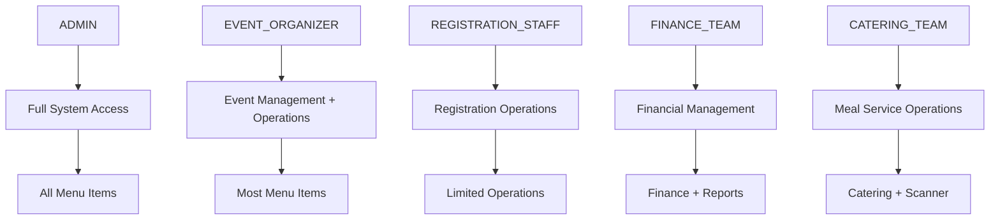
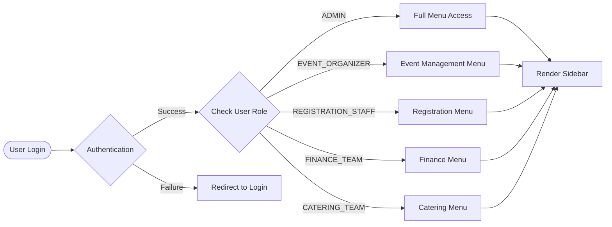
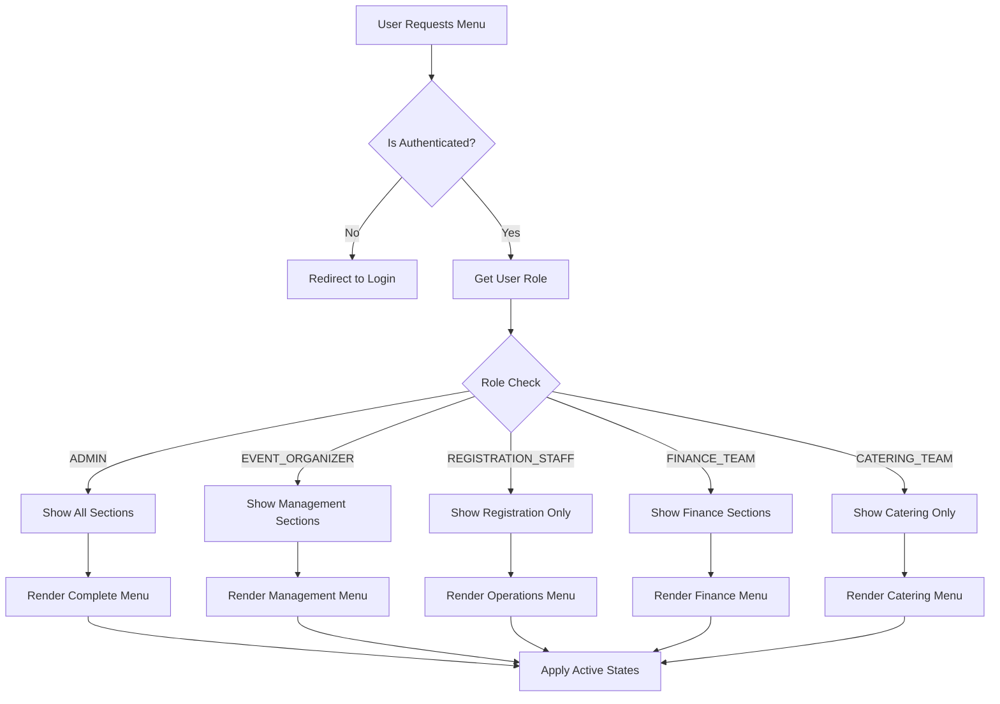

# Sidebar Menu Visual Diagrams

This document provides visual representations of the role-based access control system for the Event Registration System's admin sidebar.

## Role Hierarchy Diagram



## Menu Access Flow Diagram



## Section-Based Access Matrix

```
┌─────────────────────────────────────────────────────────────────────────────┐
│                           SIDEBAR MENU SECTIONS                            │
├─────────────────┬─────────────┬─────────────┬─────────────┬─────────────────┤
│     ROLE        │    MAIN     │   EVENT     │ OPERATIONS  │   MANAGEMENT    │
│                 │             │ MANAGEMENT  │             │   & ANALYTICS   │
├─────────────────┼─────────────┼─────────────┼─────────────┼─────────────────┤
│ ADMIN           │ ✅ Dashboard │ ✅ Events    │ ✅ All Ops   │ ✅ All Mgmt     │
│                 │             │ ✅ Create    │             │ ✅ All Analytics│
├─────────────────┼─────────────┼─────────────┼─────────────┼─────────────────┤
│ EVENT_ORGANIZER │ ✅ Dashboard │ ✅ Events    │ ✅ Most Ops  │ ✅ Most Mgmt    │
│                 │             │ ✅ Create    │             │ ✅ Most Analytics│
├─────────────────┼─────────────┼─────────────┼─────────────┼─────────────────┤
│ REGISTRATION_   │ ✅ Dashboard │ ❌ None     │ ✅ Limited   │ ❌ None         │
│ STAFF           │             │             │             │                 │
├─────────────────┼─────────────┼─────────────┼─────────────┼─────────────────┤
│ FINANCE_TEAM    │ ✅ Dashboard │ ❌ None     │ ✅ Scanner   │ ✅ Finance      │
│                 │             │             │             │ ✅ Reports      │
├─────────────────┼─────────────┼─────────────┼─────────────┼─────────────────┤
│ CATERING_TEAM   │ ✅ Dashboard │ ❌ None     │ ✅ Catering  │ ❌ None         │
│                 │             │             │ ✅ Scanner   │                 │
└─────────────────┴─────────────┴─────────────┴─────────────┴─────────────────┘
```

## Role-Specific Menu Trees

### 🔑 ADMIN - Complete Access
```
EventHub Admin Portal
├── 📱 Main
│   └── 🏠 Dashboard
├── 📅 Event Management
│   ├── 📅 Events
│   └── ➕ Create Event [New]
├── ⚙️ Operations
│   ├── ✅ Registrations
│   ├── 👨‍🍳 Catering
│   └── 📱 QR Scanner
├── 👥 Management
│   ├── 👥 Staff
│   └── 💰 Finance
└── 📊 Analytics
    ├── 📈 Reports
    └── 📋 Audit Logs
```

### 🎯 EVENT_ORGANIZER - Management Focus
```
EventHub Management Portal
├── 📱 Main
│   └── 🏠 Dashboard
├── 📅 Event Management
│   ├── 📅 Events
│   └── ➕ Create Event [New]
├── ⚙️ Operations
│   ├── ✅ Registrations
│   ├── 👨‍🍳 Catering
│   └── 📱 QR Scanner
├── 👥 Management
│   ├── 👥 Staff
│   └── 💰 Finance
└── 📊 Analytics
    ├── 📈 Reports
    └── 📋 Audit Logs
```

### 👤 REGISTRATION_STAFF - Operations Only
```
EventHub Registration Portal
├── 📱 Main
│   └── 🏠 Dashboard
└── ⚙️ Operations
    ├── ✅ Registrations
    └── 📱 QR Scanner
```

### 💰 FINANCE_TEAM - Financial Focus
```
EventHub Finance Portal
├── 📱 Main
│   └── 🏠 Dashboard
├── ⚙️ Operations
│   └── 📱 QR Scanner
├── 👥 Management
│   └── 💰 Finance
└── 📊 Analytics
    └── 📈 Reports
```

### 👨‍🍳 CATERING_TEAM - Service Focus
```
EventHub Catering Portal
├── 📱 Main
│   └── 🏠 Dashboard
└── ⚙️ Operations
    ├── 👨‍🍳 Catering
    └── 📱 QR Scanner
```

## Permission Overlap Analysis

```
┌─────────────────────────────────────────────────────────────────────────────┐
│                         MENU ITEM PERMISSIONS                              │
├─────────────────────────┬───────────────────────────────────────────────────┤
│ Dashboard               │ 🔵🟢🟠🟡🟣 (All Roles)                           │
├─────────────────────────┼───────────────────────────────────────────────────┤
│ Events                  │ 🔵🟢 (ADMIN, EVENT_ORGANIZER)                    │
├─────────────────────────┼───────────────────────────────────────────────────┤
│ Create Event            │ 🔵🟢 (ADMIN, EVENT_ORGANIZER)                    │
├─────────────────────────┼───────────────────────────────────────────────────┤
│ Registrations           │ 🔵🟢🟠 (ADMIN, EVENT_ORGANIZER, REGISTRATION_STAFF)│
├─────────────────────────┼───────────────────────────────────────────────────┤
│ Catering                │ 🔵🟢🟣 (ADMIN, EVENT_ORGANIZER, CATERING_TEAM)   │
├─────────────────────────┼───────────────────────────────────────────────────┤
│ QR Scanner              │ 🟢🟠🟡🟣 (All except ADMIN)                      │
├─────────────────────────┼───────────────────────────────────────────────────┤
│ Staff                   │ 🔵🟢 (ADMIN, EVENT_ORGANIZER)                    │
├─────────────────────────┼───────────────────────────────────────────────────┤
│ Finance                 │ 🔵🟢🟡 (ADMIN, EVENT_ORGANIZER, FINANCE_TEAM)    │
├─────────────────────────┼───────────────────────────────────────────────────┤
│ Reports                 │ 🔵🟢🟡 (ADMIN, EVENT_ORGANIZER, FINANCE_TEAM)    │
├─────────────────────────┼───────────────────────────────────────────────────┤
│ Audit Logs              │ 🔵🟢 (ADMIN, EVENT_ORGANIZER)                    │
└─────────────────────────┴───────────────────────────────────────────────────┘

Legend:
🔵 ADMIN  🟢 EVENT_ORGANIZER  🟠 REGISTRATION_STAFF  🟡 FINANCE_TEAM  🟣 CATERING_TEAM
```

## Access Control Decision Tree



## Security Considerations Diagram

```
┌─────────────────────────────────────────────────────────────────────────────┐
│                           SECURITY LAYERS                                  │
├─────────────────────────────────────────────────────────────────────────────┤
│ Frontend (UI Layer)                                                         │
│ ├── Menu Visibility Control                                                 │
│ ├── Route Guards                                                            │
│ └── Component-Level Permissions                                             │
├─────────────────────────────────────────────────────────────────────────────┤
│ API Layer (GraphQL)                                                         │
│ ├── Authentication Guards                                                   │
│ ├── Role-Based Guards                                                       │
│ └── Field-Level Permissions                                                 │
├─────────────────────────────────────────────────────────────────────────────┤
│ Database Layer                                                              │
│ ├── Row-Level Security                                                      │
│ ├── Audit Logging                                                           │
│ └── Data Encryption                                                         │
└─────────────────────────────────────────────────────────────────────────────┘
```

---

## Implementation Notes

### Current Implementation Status
- ✅ Role-based menu filtering implemented
- ✅ Dynamic section visibility
- ✅ Visual role indicators
- ✅ Responsive design
- ✅ Active state management

### Recommended Improvements
1. **Granular Permissions**: Implement permission-based access beyond roles
2. **Menu Caching**: Cache menu configurations for better performance
3. **A/B Testing**: Test different menu layouts for usability
4. **Analytics**: Track menu usage patterns by role
5. **Customization**: Allow users to customize their menu layout

This visual representation helps understand the complex role-based access control system and ensures proper implementation of security and usability requirements.
